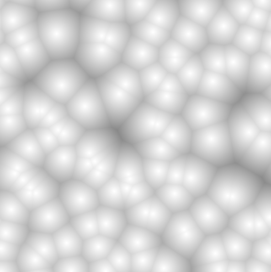
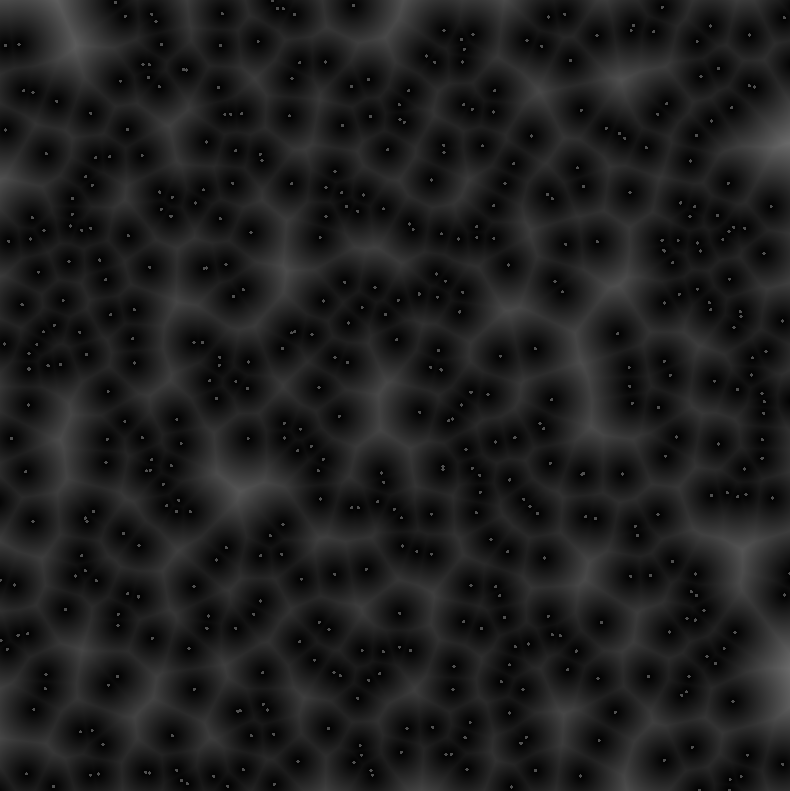

# Coding of Shaders
This repositry is a gathering of different types of shaders that I'm implementing to gain better knowledge in coding in GLSL. I'm using my own template in OpenGL where I create a simple plane or geometry to display the procedural material or lightning model that I create in my shaders. 

<h2>Voronoi Pattern</h2>

A Voronoi Diagram is the partitioning of a plane into different regions based on their distance to points in a specific subspace of the plane. We call the set of points for seeds and the number of seeds are set beforehand. We then create cells around the seeds that we call Voronoi Cells and all the points inside the same cell share the property that they are all closer to the seed for that cell than to any other seed on the plane. 

I generate random numbers according to the random function given in "The Book of Shaders". My first implementation is using a number of 200 seeds, placed randomly on the plane. The inverted image is generated by starting with white as background and then subtracting color value from the minimum distance points instead of adding.

Added the possibility to display the seeds as points to get a clearer visualization if needed. Here with 200 respectively 500 seeds.

