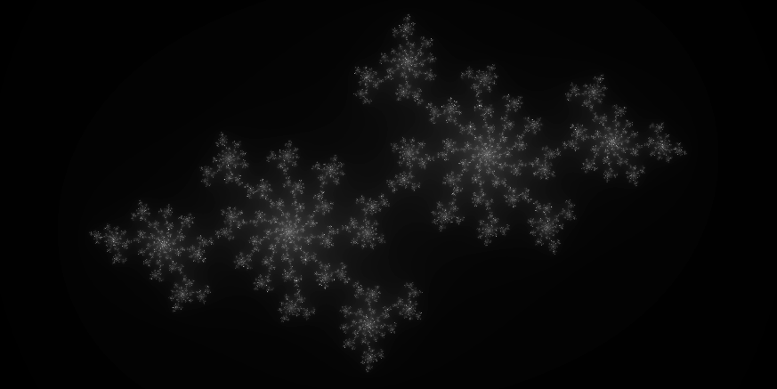
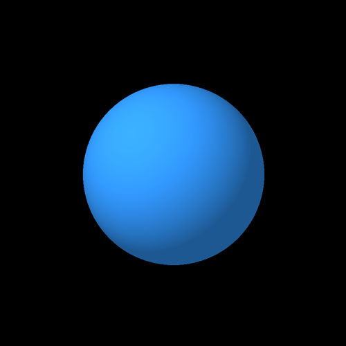

# Coding of Shaders
This repositry is a gathering of different types of shaders that I'm implementing to gain better knowledge in coding in GLSL. I'm using my own template in OpenGL where I create a simple plane or load a geometry to display the shader. You can read more about the respective shaders below.

- [Patterns](##pattern)
- [Set Visualizations](#set-visualization)
- [Shading](#shading)

## Pattern

    
<b>Voronoi</b>

A Voronoi diagram is the partitioning of a plane into different regions based on their distance to points in a specific subspace of the plane. We call the set of points for seeds and the number of seeds are set beforehand. We then create cells around the seeds that we call Voronoi Cells and all the points inside the same cell share the property that they are all closer to the seed for that cell than to any other seed on the plane.

I generate random numbers according to the random function given in "The Book of Shaders". My first implementation is using a number of 200 seeds, placed randomly on the plane. The inverted image is generated by starting with white as background and then subtracting color value from the minimum distance points instead of adding.

 

A further update was added with the possibility to display the seeds as points to get a clearer visualization if needed. Here with a smaller and larger number of generated seeds.

 

Implemented the pattern on a sphere and added the Phong local reflection model to the scene.

## Set Visualization

    
<b>Julia Set</b>

In general, the Julia and Mandelbrot set is the boundary between points in the complex number plane ([src](https://www.britannica.com/science/Julia-set)). In this shader, I have used the set of complex numbers `c` for which the function `f(z)=z^2+c` does not diverge to infinity when iterated from a fixed complex number `c` ([src](https://en.wikipedia.org/wiki/Julia_set)).

The fractals that can be generated from the Julia set is many and very artistic looking. By altering the complex number from which we iterate, a number of different appearances can be retrieved as can be seen below.

The Julia set for the complex number c = -0.4 + 0.6i.

The Julia set for the complex number c = -0.70176 - 0.3842i.

The Julia set for the complex number c = 0.285 + 0.01i.

The Julia set for the complex number c = -0.835 - 0.2321i.

This is a Dendrite fractal, which is on the boundary of the Mandelbrot set, generated using c = i.

The Douady's rabbit fractal, generated using c = -0.123 + 0.745i.
[The Douady rabbit on Wikipedia](https://en.wikipedia.org/wiki/Douady_rabbit).

    
<b>Mandelbrot Set</b>

The Mandelbrot set is a subset of the Julia set, where the Mandelbrot set is those complex numbers, c, for which the Julia set is connected ([src](https://en.wikipedia.org/wiki/Mandelbrot_set)). The Mandelbrot Set shader is similar to the one for the Julia set, we still use the function `f(z)=z^2+c` to generate the expression but this time iterate from `z=0`, e.g. the expression used is `f(z)=z^2`.

By increasing the number of iterations per pixel over time, it is possible to create an animated version of the set as can be seen below.

The Mandelbrot set is popular for having very artistic looking fractals, the following two images have been created by zooming in on specific areas of the set and changing the background color for the image to the left.

 

## Shading

    
<b>Phong</b>

This shader implements a simple version of Phong's reflection model for surface shading. It decides the color of each pixel based on ambient, diffuse and specular light terms. For more explanations about the vector math and the equations behind the shader, see the [Phong Reflection Model](https://en.wikipedia.org/wiki/Phong_reflection_model).

In this simple shader, I have modelled a single light source at a static point in 3D space, but the model can easily be extended to bring in the light positions from the main OpenGL scene instead. Then the diffuse and specular terms should be applied as a sum per light source.

### Ambient light
The ambient light term essentially decides the base color of the object, it is modelled simply by the reflection coefficient (RGB based) times the light intensity. When using only the ambient term applied to a simple sphere, the result is a s follows where the color is decided by the reflection constant `k_ambient`:

 

### Diffuse light
The diffuse light term will start to give the object a sense of depth. To put it in basic terms, the fragments that are closer to the light source will get more light compared to the ones farther away (and the ones that the light source doesn't reach will of course not get any light).

 

### Specular light
The specular light term will add additional reflections, similar to the diffuse term it depends on the distance and angle towards the light source but also depends on the view direction.

You can also see the difference of altering of the constant `alpha`. To the left is a low value of this shininess parameter and to the right is a high value, e.g. simulating a more reflective material.

 

An important thing when calculating the specular reflection term is to check that the dot product between the light direction and the normal is positive. If it is not and we still apply a specular term in this case, we will end up adding specular reflections in areas that should not get any light and are essentially behind the light source or hidden. To showcase this, I added a red color for fragments when the dot product is negative:

    
<b>Blinn-Phong</b>

This shader implements the Blinn-Phong reflection model for surface shading. This reflection model is similar to the Phong reflection model but by utilising the so called half-vector, we are able to replace the `R•V` expression for the specular highlights to be `N•H` (where H is the half-way vector). By incorporating the normals in the expression, we will get specular highlights that better reflects how an item looks in the real world, since it will no longer remain circular but instead turn elliptical when the viewer looks at the item from a steeper angle. For more explanations about the vector math and the equations behind the shader, see the [Blinn-Phong Reflection Model](https://en.wikipedia.org/wiki/Blinn%E2%80%93Phong_reflection_model).

In this simple shader (similar to the Phong reflection model), I have modelled a single light source at a static point in 3D space, but the model can easily be extended to bring in the light positions from the main OpenGL scene instead. Then the diffuse and specular terms should be applied as a sum per light source.

Since the ambient and diffuse light terms remain the same as for the Phong reflection model, only the specular light is showed below.

### Specular light
With the replacement of the specular term using the half-way vector, we can see the difference between the Phong reflection model (to the left), and the Blinn-Phong reflection model (to the right) for the same settings.

 

    
<b>Toon Shader</b>

This is a simple toon shader that creates an outline around an object and 3 different levels of colors, including specular highlights. A small example can be seen below when applied to the Monkey mesh (obtained from Blender) and a simple sphere. Note that in the right image, the specular highlights have been set to 0.

 

Most of the functionality in this shader is done by simple `smoothstep` functions, both for the outline and for creating different levels of the colors. The values for the edges in `smoothstep` can be altered to emphasize certain effects or for moving the limiter of where the color change is done.

The specular term is inspired by the Blinn-Phong reflection model and calculates the specular term in that way, but in order to keep the toon effect, it is only added if the specular value is below a certain threshold. With the specular exponent as in Blinn-Phong, we can still simulate shiny and non-shiny materials, as can be seen below where the specular exponent is set to a low value to the left, and to a high value to the right.

 

## License
This project is licensed under the MIT license. See the license file for more details.